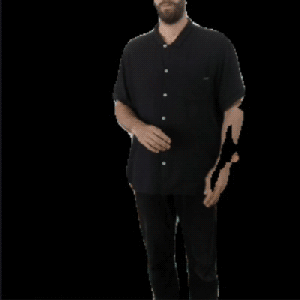
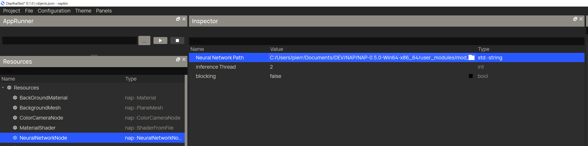

# Nap-depthai-core
[DepthAI-Core](https://github.com/luxonis/depthai-core) [Oak-D Lite](https://docs.luxonis.com/projects/hardware/en/latest/pages/DM9095.html) in [Nap Frameworks](https://www.napframework.com/) (Windows)

<br>

Semantic Segmentation example:

<br>




<br>

## Getting started

### Installation

<br>

Download [Nap Framework version 0.5.0](https://www.napframework.com/) and check installation from [here](https://github.com/napframework/nap/releases). 

<br>

Download [Depthai-core](https://github.com/luxonis/depthai-core) and compile it.

<br>

1) Copy the [Semantic Segmentation Example](./depthaicoresemanticsegexample) folder into your `Nap_Install/projects/` folder.
2) Copy the [DepthAi Core lib](./mod_depthaicore) into your  `Nap_Install/user_modules/` folder.


### Compile on Windows

<br>

#### Cmake variables

<br>

Set the 2 Cmake variables (`OpenCV_DIR` and `depthai_DIR`) inside the [module_extra.cmake](./mod_depthaicore/module_extra.cmake):

```sh
#for me
set(OpenCV_DIR "C:\\dev\\opencv\\opencv\\build")
set(depthai_DIR "C:\\Users\\pierr\\Documents\\DEV\\DEPTHAI_DEV\\build_2")
```

<br>

#### regenerate

<br>

Make sure to [regenerate](./depthaicoresemanticsegexample/regenerate.bat) your project example, then open it in your version of Visual Studio (I'm using VS2019).

<br>

Compile the depthaicoresemanticsegexample solution.

<br>

Once compilation is finished, open the [project.json](./depthaicoresemanticsegexample/project.json) in Napkin.

<br>

Once opened, find the NeuralNetwork Node and make sure that its path points to the correct blob(`deeplabv3p_person_6_shaves.blob`), inside the `user_modules/data/nn/` folder :

<br>



<br>

Save it, the run executable.